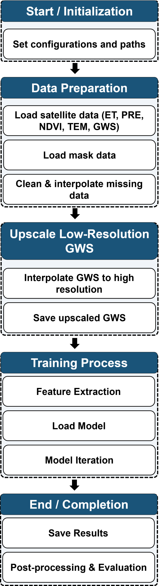

# 🌍 Groundwater Storage Downscaling Project

## 📖 Overview

This project focuses on **downscaling coarse-resolution Groundwater Storage (GWS)** data using high-resolution environmental variables including:

* Precipitation (PRE)
* Evapotranspiration (ET)
* Temperature (TEM)
* Vegetation Index (NDVI)

The objective is to improve the **spatial resolution** of GWS data by leveraging **multi-source geospatial features** and **deep learning models**, enabling finer-scale groundwater monitoring for regional hydrological studies.

---

## 📂 Key Components

### 🔹 Data Loading & Preprocessing

* Reads geospatial raster (`.tif`) and measurement Excel files
* Applies masking and spatial interpolation
* Normalizes and stacks feature inputs

### 🔹 Upscaling

* Interpolates low-resolution GWS using:

  * **Bilinear**
  * **Cubic**
  * **Nearest-neighbor** interpolation
* Matches spatial dimensions of environmental features

### 🔹 Deep Learning Model

* ResNet-based architecture tailored for geospatial downscaling tasks
* Ingests stacked features and GWS input to generate high-resolution predictions

### 🔹 Prediction Pipeline

* Loads processed data
* Applies trained model
* Saves output GWS predictions as GeoTIFFs

### 🔹 Utility Scripts

* Masking tool for applying region-based exclusion
* Interpolation utilities
* TIFF/Excel readers

### 🔹 Configuration

* Centralized `config.py` for:

  * Path management
  * Feature selection
  * Spatial/temporal settings

---

## 🗂 Directory Structure

```
├── config.py                 # Global project settings and paths
├── data_reading.py          # File I/O and geospatial helpers
├── dataloader.py            # Data loading and formatting pipeline
├── generate_upscaled_gws.py # Interpolation of low-res GWS data
├── mask_apply.py            # Apply masks to environmental datasets
├── model.py                 # ResNetDownscalingModel architecture
├── test.py                  # Model inference and prediction script
├── utils.py                 # Misc utilities (interpolation, writing)
├── requirements.txt         # Required Python packages
├── README.md                # Project documentation
├── outputs/                 # Folder for saving model results
└── assets/
    └── Flowchart.png        # Project pipeline diagram
```

---

## 🔧 Requirements

* **Python 3.7+**
* Dependencies listed in `requirements.txt`

Install with:

```bash
pip install -r requirements.txt
```

---

## 🚀 Usage Workflow

1. **Prepare Data**

   * Place `.tif` environmental features and groundwater measurement Excel files in appropriate folders.

2. **Apply Mask**

   * Run `mask_apply.py` to mask irrelevant regions (e.g., oceans, outside basin).

3. **Upscale GWS**

   * Use `generate_upscaled_gws.py` to interpolate GWS data to high resolution.

4. **Model Inference**

   * Load trained model weights or train from scratch.
   * Run `test.py` to generate downscaled GWS predictions.

5. **Postprocessing**

   * Visualize or analyze output `.tif` files stored in `/outputs`.

---

## 🧠 Flowchart

Below is the full pipeline of the downscaling workflow:



> **Figure**: End-to-end pipeline showing data preprocessing, interpolation, model inference, and output generation.

---

## 📌 Notes

* Missing or invalid values (e.g., `-9999`, `NaN`) are handled via masking or interpolation.
* The system supports flexible feature selection and time ranges via `config.py`.
* Designed for scalability across different regions (e.g., Yellow River Basin, Tibetan Plateau).

---

## 📬 Contact

For questions or collaboration inquiries, please contact the **project maintainer** or your research group's GitHub organization administrator.

